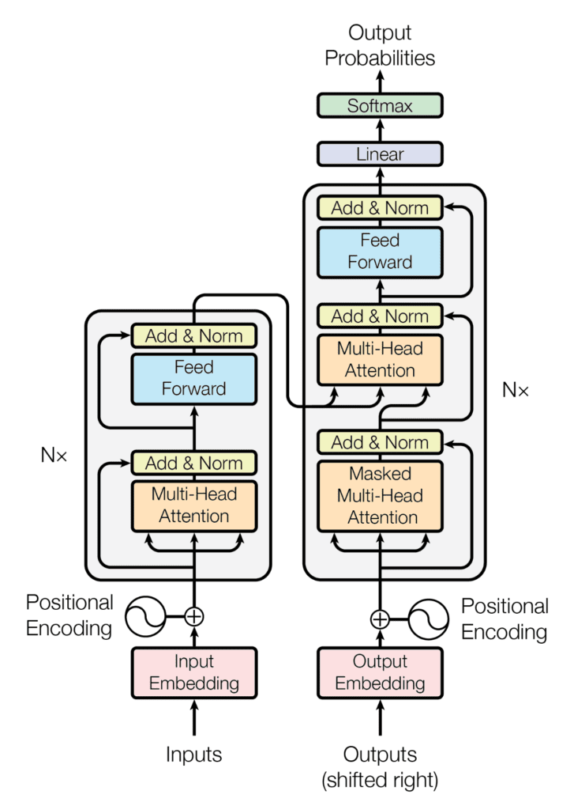
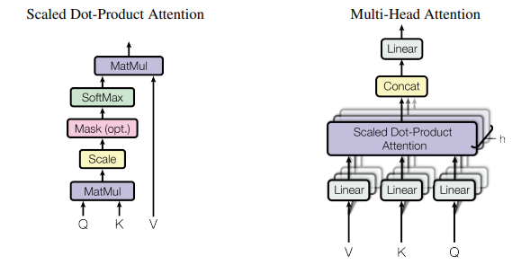
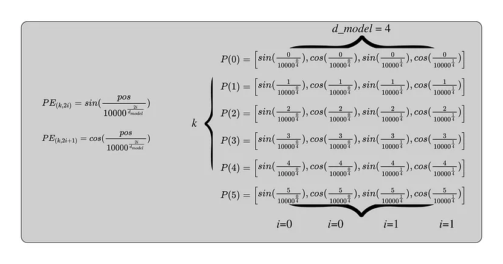

# TRANSFORM TRM PYTORCH
> 
> Cite: https://github.com/nickchen121/Pre-training-language-model
> 

#### PADDING MASK
inputs = ['my name is steve and i want to do nlp', 'i like cat']
vacb = {'<PAD>': 0, 'my': 1, 'name': 2, ...}
max_len = 6
pad = <PAD>

inputs = ['my name is steve and i', 'i like cat <PAD> <PAD> <PAD>']
inputs_ids = [[0, 1, 2, 3, 4], [4, 5, 6, 0, 0, 0]]